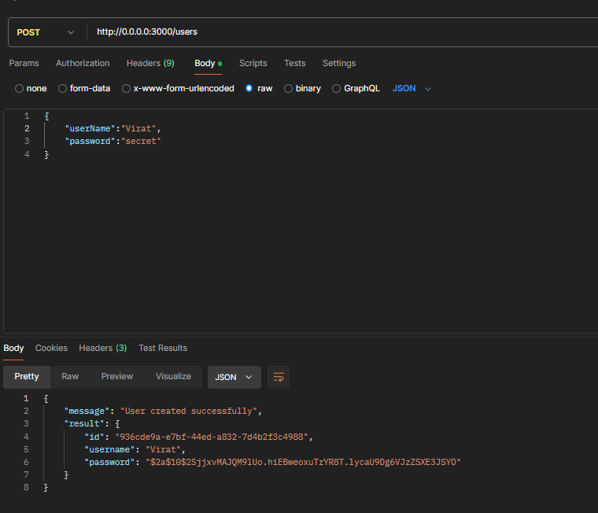

# Book Management API

## Overview

This project involves creating an API to manage a list of books for users. The API includes functionalities for user management, book creation, and book-user relationships, all protected by secure authentication mechanisms.

## API Operations

### User Management

1. **Create a New User (POST /users)**

   - **Description:** Create a new user with a username and password.
   - **Security:** Passwords are securely hashed before storage using bcryptjs and hash is checked to verify the correct password
   - **Constraints:** Usernames must be unique. In constructor user is checked if it exists, if not then is registered.
   - **Request Body:**
     ```json
     {
       "username": "user123",
       "password": "securepassword"
     }
     ```
     -**ScreenShot:** 

2. **Authenticate a User (POST /users/authenticate)**
   - **Description:** Authenticate a user and return a JWT token.
   - **Request Body:**
     ```json
     {
       "username": "user123",
       "password": "securepassword"
     }
     ```
   - **Response:**
     ```json
     {
       "token": "jwt-token"
     }
     ```

### Book Management

3. **Create a New Book (POST /books)**

   - **Description:** Create a new book. Only authenticated users can create books.
   - **Request Body:**
     ```json
     {
       "bookName": "Book Title"
     }
     ```
   - **Headers:**
     - `Authorization: Bearer <token>`

4. **Attach a Book to a User (POST /users/:userId/books/:bookId)**

   - **Description:** Attach a book to a user. Only authenticated users can attach books to themselves.
   - **Request Parameters:**
     - `userId`: ID of the user.
     - `bookId`: ID of the book.
   - **Headers:**
     - `Authorization: Bearer <token>`

5. **Get All Books (GET /books)**

   - **Description:** Retrieve a list of all books.

6. **Get Book by ID (GET /books/:bookId)**
   - **Description:** Retrieve details of a specific book by ID.

## Testing

Tests for the API operations are included in the `spec` folder and cover the following aspects:

- **API Layer:** Verifies the correctness of API responses and status codes.
- **Authentication and Authorization:** Ensures that only authenticated users can perform certain operations and that users can only affect their own data.
- **Validation:** Checks that the API correctly validates inputs and handles errors.

To run tests, use the following command:

```bash
npm test
```
